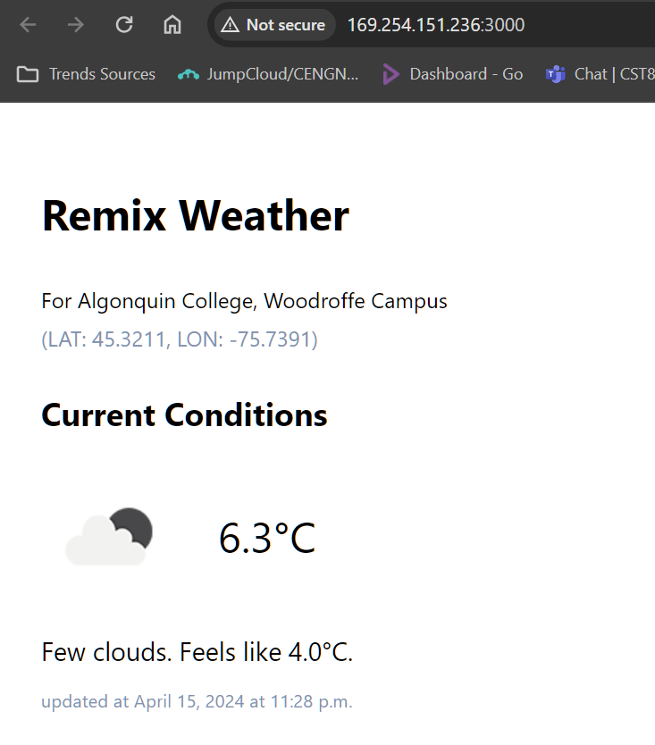
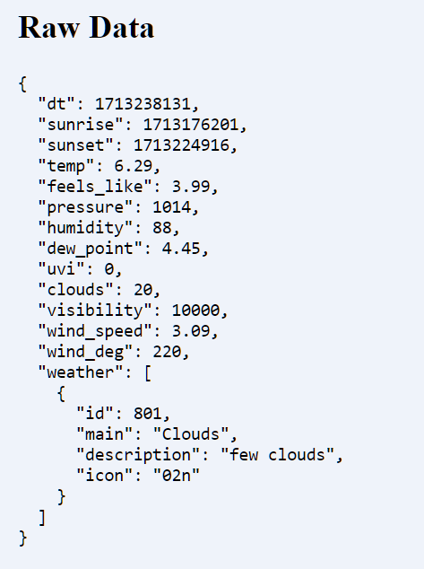

# Final-IaC

Team members:
Brent Encarnado https://github.com/brentencarnado
Chowdhurysal Ferdowsy https://github.com/chowdhury611
Cameron Barber https://github.com/barb0238
Andrew Han https://github.com/han00116

## Define Resources

Created blob storage and container using Terraform

Created a Terraform module for the AKS clusters

- Created an AKS cluster in the `test` environment
  - 1 node
  - Standard B2s VM size
  - Kubernetes version 1.29.2
- Created an AKS cluster in the `prod` environment
  - min 1 node
  - max 3 nodes
  - Standard B2s VM size
  - Kubernetes version 1.29.2
    

Ensured the service principal specified in the Terraform configuration had the appropriate permissions.

Updated Terraform configuration with the newly generated credentials.

Then, I used 'terraform apply' and It worked

We got the Remix weather app working, but not deployed on the kubernetes cluster:

